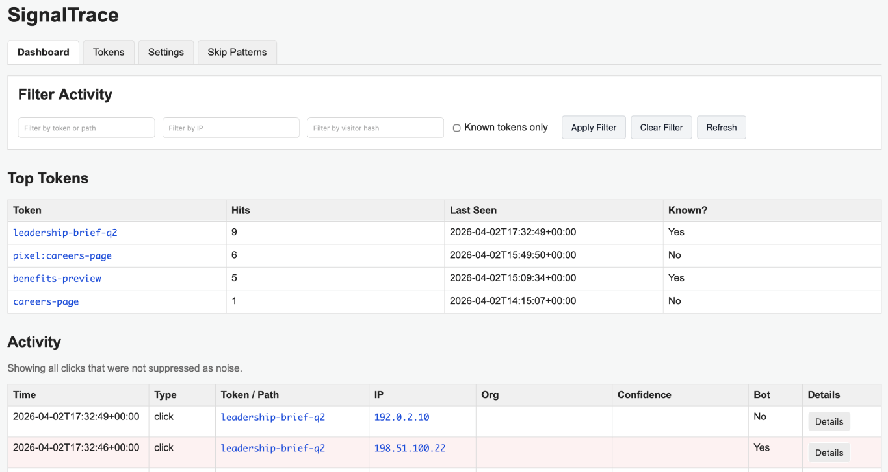

# SignalTrace


SignalTrace is a lightweight, self-hosted tracking and analysis platform for observing interactions with custom paths and generating actionable telemetry.

It captures interactions in real time and can expose that data as a simple, practical threat feed for use in other security tools.

---

## What SignalTrace Does

SignalTrace lets you create custom tokens (paths) that:

1. Capture detailed request data  
2. Score and classify the interaction  
3. Redirect to a destination  

It provides visibility into who is actually interacting with endpoints, not just whether they were accessed.

Common use cases:

- Phishing simulations  
- Honeypots  
- Reconnaissance detection  
- Link tracking  
- Threat feed generation  

---

## Features

### Core Tracking

- Custom tokens with redirect support  
- Full request logging (IP, headers, user agent, and more)  
- Visitor fingerprinting  
- Tracking pixel support (records `pixel` event type)  
- Event types:
  - `click`
  - `pixel`

### Scoring and Detection

- Confidence scoring system:
  - human  
  - likely-human  
  - suspicious  
  - bot  

- Human-likelihood scoring (0–100 scale)

- Detection signals:
  - Missing headers (Accept, Language, Encoding)  
  - Browser vs automation user agent analysis  
  - Bot signature detection  
  - Raw IP host detection  

- Path-based detection:
  - `.env`  
  - `.git`  
  - `phpinfo`  
  - `wp-admin`  
  - and similar probes  

- Behavioral detection:
  - Rapid repeat requests  
  - Burst activity  
  - Multi-token scanning  

- Query inspection:
  - Exploit-like patterns such as `cmd=` and traversal attempts  

- ASN-based scoring (configurable from the UI)

### Filtering and Analysis

- Filter by:
  - token / path  
  - IP  
  - visitor hash  
  - date range  

- Display controls:
  - Known tokens only  
  - Show Top Tokens toggle  
  - Show All override  

- Active filter pills with one-click removal  

- Classification display with score (for example, `suspicious [44]`)  

### Token Management

- Create tokens  
- Edit existing tokens  
- Activate / deactivate tokens  
- Delete tokens, with optional click cleanup  
- Copy token URLs from the UI  
- Copy pixel URLs from the UI  

### Cleanup Tools

#### Token Cleanup

- Delete unknown token hits  
- Delete all clicks for a token  

#### IP Cleanup

- Delete unknown-only clicks for an IP  
- Delete all clicks for an IP  
- Available:
  - per-event in the Actions panel  
  - when filtering by IP  

### Noise Handling

- Skip patterns:
  - Exact  
  - Contains  
  - Prefix  

- Add skip patterns directly from activity  

- Noise filtering toggle in the UI  

### ASN Rules

- Add ASN-based scoring rules directly from the UI  
- ASN visibility in the activity feed  
- Indicator when an ASN rule is active  
- Useful for:
  - cloud providers  
  - scanners  
  - known infrastructure  

### Exporting Data

- Export activity data from the system  
- Exports currently include the full dataset and are not yet filter-aware  
- Useful for:
  - offline analysis  
  - SIEM ingestion  
  - incident review  

### Threat Feed

- Built-in IP threat feed: `/feed/ips.txt`

- Includes:
  - IPs classified as suspicious or bot  
  - Only events with scoring data  
  - Deduplicated output  

- Configurable:
  - time window  
  - minimum classification threshold  

### Platform

- SQLite backend with no external database required  
- GeoIP enrichment with MaxMind  
- Minimal, fast, framework-free design  

---

## Screenshot

[](docs/images/dashboard.png)

---

## Minimum Requirements

SignalTrace is designed to run on very small systems.

Recommended minimum:

- 1 vCPU  
- 1 GB RAM  
- 1 GB swap  
- 5–10 GB disk  

Tested on a small VM with 1 GB RAM and swap enabled.

---

## Installation (Ubuntu + Apache)

### 1. Install dependencies

```bash
sudo apt update
sudo apt install -y apache2 php php-sqlite3 php-mbstring php-xml php-curl sqlite3 composer unzip
```

### 2. Install PHP dependencies

```bash
composer install
```

### 3. Create the data directory

```bash
sudo mkdir -p /var/www/signaltrace/data
sudo chown -R www-data:www-data /var/www/signaltrace/data
sudo chmod -R 775 /var/www/signaltrace/data
```

### 4. Initialize the database

```bash
sqlite3 /var/www/signaltrace/data/database.db
.read db/schema.sql
```

### 5. Optional: load sample data

```bash
sqlite3 /var/www/signaltrace/data/database.db
.read db/seed.sql
```

---

## Configuration

SignalTrace uses a local configuration file for secrets.

### Create the local config

```bash
cp includes/config.local.php.example includes/config.local.php
```

### Edit the config

```bash
vi includes/config.local.php
```

Example:

```php
<?php
define('ADMIN_USERNAME', 'admin');
define('ADMIN_PASSWORD_HASH', 'replace-me');
define('VISITOR_HASH_SALT', 'replace-me');
```

### Generate a password hash

```bash
php -r "echo password_hash('your-password', PASSWORD_DEFAULT) . PHP_EOL;"
```

### Generate a visitor hash salt

```bash
openssl rand -hex 64
```

---

## Apache Configuration

Create the site config:

```bash
sudo vi /etc/apache2/sites-available/signaltrace.conf
```

Use:

```apache
<VirtualHost *:80>
    ServerName yourdomain.example
    DocumentRoot /var/www/signaltrace/public

    <Directory /var/www/signaltrace/public>
        AllowOverride All
        Require all granted
    </Directory>

    ErrorLog ${APACHE_LOG_DIR}/signaltrace_error.log
    CustomLog ${APACHE_LOG_DIR}/signaltrace_access.log combined
</VirtualHost>
```

Enable the site:

```bash
sudo a2enmod rewrite
sudo a2ensite signaltrace.conf
sudo a2dissite 000-default.conf
sudo systemctl restart apache2
```

---

## .htaccess

Place this in `public/.htaccess`:

```apache
RewriteEngine On

RewriteRule ^\.well-known/acme-challenge/ - [L]

RewriteCond %{REQUEST_FILENAME} !-f
RewriteCond %{REQUEST_FILENAME} !-d
RewriteRule ^ index.php [QSA,L]
```

This allows Let's Encrypt validation and routes application traffic correctly.

---

## HTTPS (Let's Encrypt)

```bash
sudo apt install -y certbot python3-certbot-apache
sudo certbot --apache
sudo certbot renew --dry-run
```

---

## Admin Access

Open:

```text
https://yourdomain.example/admin
```

---

## Threat Feed

SignalTrace includes a built-in threat feed:

```text
/feed/ips.txt
```

### What it includes

- IPs classified as suspicious or bot  
- Only events with scoring data  
- Deduplicated output  

### What it is for

This feed is designed to be consumed by other tools, such as:

- Firewalls and block lists  
- SIEM enrichment  
- Detection pipelines  
- Temporary deny lists  

### Configuration

Threat feed behavior is controlled in the Settings tab:

- time window  
- confidence threshold  

---

## Exporting Data

SignalTrace also provides export functionality for activity data.

### Current behavior

- Export includes the full dataset  
- Export is not yet filter-aware  
- Useful for:
  - offline analysis  
  - SIEM ingestion  
  - incident review  

---

## Interface Overview

### Dashboard

- Live activity feed  
- Expandable request details  
- Classification with score  
- Filtering and cleanup tools  
- Export functionality  

### Tokens

- Manage tokens  
- Copy URLs and pixel links  
- Enable / disable tokens  
- Cleanup options  

### Settings

- App configuration  
- Pixel toggle  
- Noise filtering  
- Threat feed settings  

### Skip Patterns

- Suppress noise  
- Manage patterns  

### ASN Rules

- Add / remove ASN rules  
- Adjust scoring behavior  
- Visual indicators in the dashboard  

---

## Project Structure

```text
signaltrace/
├── LICENSE
├── README.md
├── composer.json
├── composer.lock
├── data/
│   └── database.db
├── db/
│   ├── schema.sql
│   └── seed.sql
├── docs/
│   └── images/
│       └── dashboard.png
├── includes/
│   ├── admin_actions.php
│   ├── admin_view.php
│   ├── auth.php
│   ├── config.local.php.example
│   ├── config.php
│   ├── db.php
│   ├── helpers.php
│   └── router.php
├── public/
│   └── index.php
└── vendor/
```

### What these directories are for

- `public/` — Web root and only exposed directory  
- `includes/` — Application logic and routing  
- `db/` — Schema and seed files  
- `data/` — Runtime SQLite database storage  
- `docs/images/` — Documentation assets  
- `vendor/` — Composer dependencies  

---

## Security Notes

- `config.local.php` is not committed  
- Passwords are stored as hashes  
- Only `/public` should be web accessible  
- Internal directories should not be web accessible  
- Admin uses HTTP Basic Auth  

---

## Production Checklist

- Enable HTTPS  
- Set strong admin credentials  
- Generate a unique visitor hash salt  
- Verify only `/public` is exposed  
- Configure skip patterns  
- Configure ASN rules  
- Tune threat feed settings  
- Review noise filtering for your environment  

---

## Use Cases

- Phishing simulation tracking  
- Honeypot telemetry  
- Recon detection  
- Link tracking  
- Threat feed generation  
- Security research  

---

## Tech Stack

- PHP  
- SQLite  
- Apache  
- MaxMind GeoIP2  

---

## Disclaimer

SignalTrace is designed for security visibility and testing.

It will attract scanners, bots, and automated systems by design.

Use it with awareness of your environment and risk tolerance.

---

## License

MIT License

---

## Contributing

Pull requests are welcome.

---

## Final Note

Most tools try to hide noise.

SignalTrace makes it visible — and gives you control over what matters.
